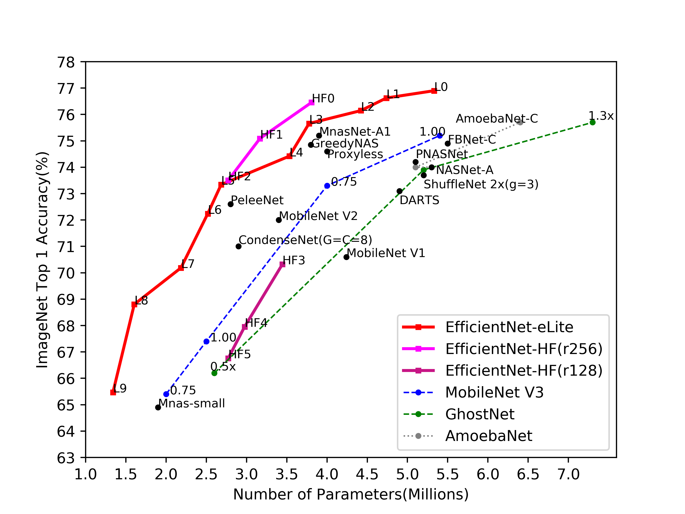

# EfficientNet-eLite: Extremely Lightweight and Efficient CNN Models for Edge Devices by Network Candidate Search
Pytorch implementation for paper [EfficientNet-eLite](https://arxiv.org/abs/2009.07409) 

We purpose a family of Extremely lightweight CNN models by EfficientNet to be effectively scaled down. The following image illustrates the performance of parameter usage and the top-1 accuracy on ImageNet dataset. More details can be found at paper [EfficientNet-eLite](https://arxiv.org/abs/2009.07409) 



## Environment
###Anaconda 4.7.12

  * Python 3.6.9 
  
  * pytorch 1.2.0, torchvision 0.4.0, cuda10
  
  * git+https://github.com/wbaek/theconf@de32022f8c0651a043dc812d17194cdfd62066e8
  
  * git+https://github.com/ildoonet/pytorch-gradual-warmup-lr.git@08f7d5e
  
  * git+https://github.com/ildoonet/pystopwatch2.git
  
  * git+https://github.com/hyperopt/hyperopt.git

  * pretrainedmodels
  
  * tqdm
  
  * tensorboardx
  
  * sklearn
  
  * ray
  
  * matplotlib
  
  * psutil
  
  * requests
  

## Start training a model
### Example for EfficientNet-eLite 9 
$ bash run.sh
```
source ~/miniconda3/etc/profile.d/conda.sh 

conda activate 'name of your conda environment'

python3 FastAutoAugment/train.py -c confs/efficientnet_l9.yaml --aug fa_reduced_imagenet  --dataroot 'Path of ImageNet on server'
```
Note : 

&nbsp; 1. Specify -c confs/efficientnet_l8.yaml -c confs/efficientnet_l7.yaml ...... to begin the other training of EfficientNet-eLite family

&nbsp; 2. --aug fa_reduced_imagenet to select the data augmentation policy (implementation is from [Fast Autoaugmentation](https://arxiv.org/abs/1905.00397))

&nbsp; 3. --dataroot should be configured as the path root of ImageNet dataset with the subfolder consisting 'train' and 'val'.

&nbsp; In the inside folder of train and val, each subfolder has the name of the label and the organization is the same for using ImageFolder from torchvision 


